# Seminar 1

## Task 1

1. Install Node.js and NPM (if not already installed).
2. Create a new React project using Create React App by running npx create-react-app my-first-react-app in the terminal.

After installation you will receive the following message:
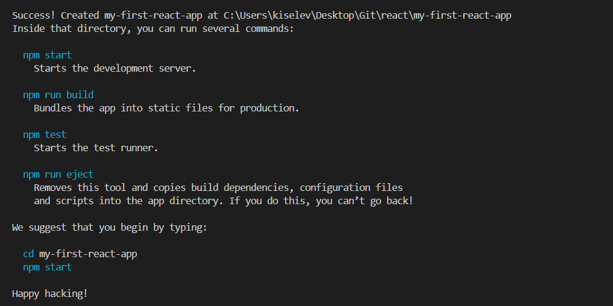

3. Run the project using npm start in the project directory and make sure the app renders in the browser.

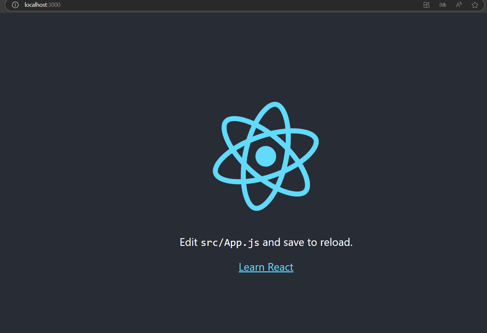

4. Replace the template text with your own

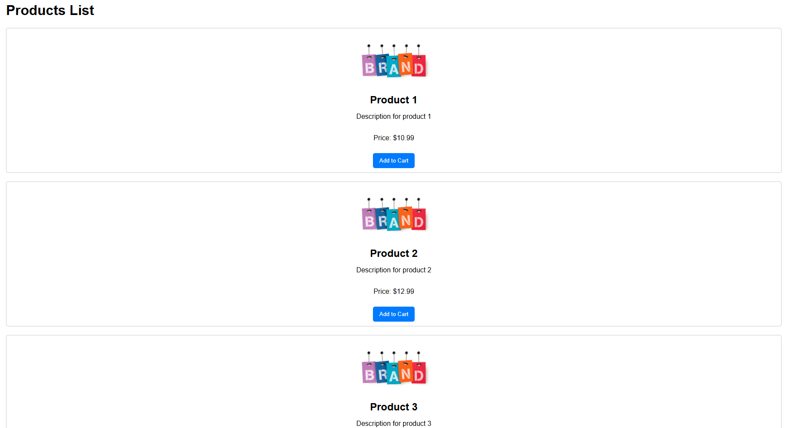

## Task 2

1. Create a functional component Greeting that outputs a simple greeting, such as <h1>Hello, React!</h1>.

- Open your React project.
- In the src folder, create a new file called Greeting.js.
- In this file, create a functional component that will display the greeting.

```JavaScript
import React from 'react';

const Greeting = () => {
return <h1>Hi, React!</h1>;
};

export default Greeting;
```

2. Import the Greeting component into App.js and use it inside the App component.

Open the App.js file and import the Greeting component. Then use it inside the main App component.

```JavaScript
import React from 'react';
import './App.css';
import Greeting from './Greeting';

function App() {
    return (
        <div className="App">
            <Greeting />
        </div>
    );
}

export default App;
```

3. Run the application and verify that the greeting is displayed on the page.

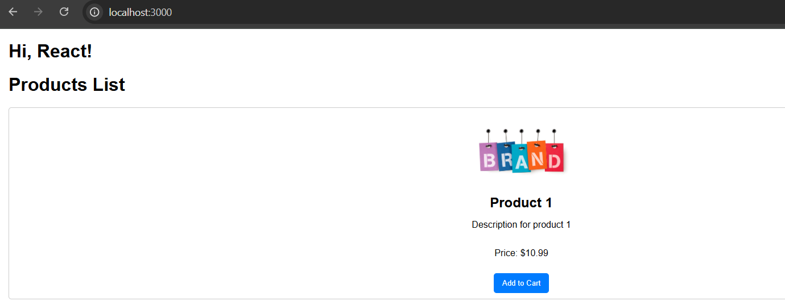

## Task 3

1. Create a functional CurrentTime component that will display the current time formatted in a human-readable way (e.g. "Current time: 14:35").

- In your React project, create a new file named CurrentTime.js in the src folder.
- In this file, create a functional component that will display the current time.

2. Use a Date object to get the current time and the toLocaleTimeString() method to format it.

```JavaScript
import React from 'react';

const CurrentTime = () => {
const currentTime = new Date().toLocaleTimeString(); // Get the current time in a human-readable format

return (
<h2 style={{ color: 'blue', textAlign: 'center' }}>
Current time: {currentTime}
</h2>
);
};

export default CurrentTime;
```

3. Import the CurrentTime component into App.js and use it inside the App component to display the current time on the page.

```JavaScript
import React from 'react';
import './App.css';
import CurrentTime from './CurrentTime';

function App() {
return (
<div className="App">
<CurrentTime />
</div>
);
}

export default App;
```

4. Add minimal styling to the CurrentTime component to highlight the displayed time (e.g. use an h2 for the title and some CSS to improve the appearance).

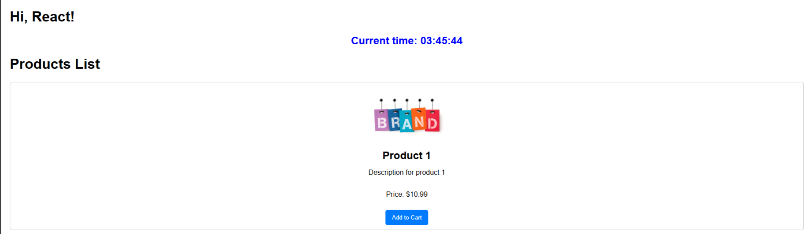

## Task 4

1. Modify the Greeting component to display different greetings depending on the time of day, such as "Good morning" or "Good evening", using conditional rendering.

2. Use new Date().getHours() to determine the current time and set a condition to display the appropriate greeting.

```JavaScript
const Greeting = () => {
const currentHour = new Date().getHours(); // Get the current hour
let greeting;

// Set the greeting depending on the time of day
if (currentHour < 12) {
greeting = "Good morning!";
} else if (currentHour < 18) {
greeting = "Good afternoon!";
} else {
greeting = "Good evening!";
}

return <h1>{greeting}</h1>; // Display the appropriate greeting
};
```

3. Run the application and verify that the appropriate greeting is displayed depending on the time of day.

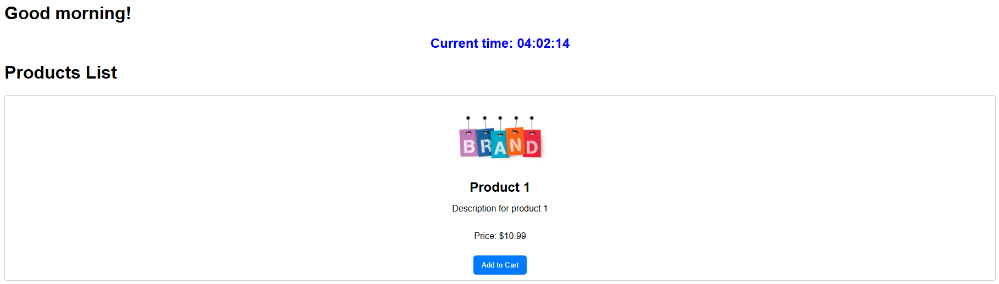

## Task 5

1. Create a functional EventCard component that will display event information: title, date, and location. The component should receive this data via props.

```JavaScript
import React from 'react';
import './EventCard.css';

const EventCard = ({ title, date, location }) => {
    return (
        <div className="event-card">
            <h2 className="event-title">{title}</h2>
            <p className="event-date">{date}</p>
            <p className="event-location">{location}</p>
        </div>
    );
};

export default EventCard;
```

2. In the App component, use the EventCard component multiple times with different event data passed via props to show a list of upcoming events.

```JavaScript
<h1>Upcoming events</h1>
      {events.map((event, index) => (
        <EventCard
          key={index}
          title={event.title}
          date={event.date}
          location={event.location}
        />
      ))}
```

3. Add minimal styling to the EventCard component using CSS classes to visually highlight the information about each event

```CSS
.event-card {
    border: 1px solid #ccc;
    border-radius: 8px;
    padding: 16px;
    margin: 16px;
    background-color: #f9f9f9;
    box-shadow: 0 2px 5px rgba(0, 0, 0, 0.1);
}

.event-title {
    font-size: 1.5em;
    margin: 0 0 8px;
}

.event-date, .event-location {
    margin: 4px 0;
    color: #555;
}
```

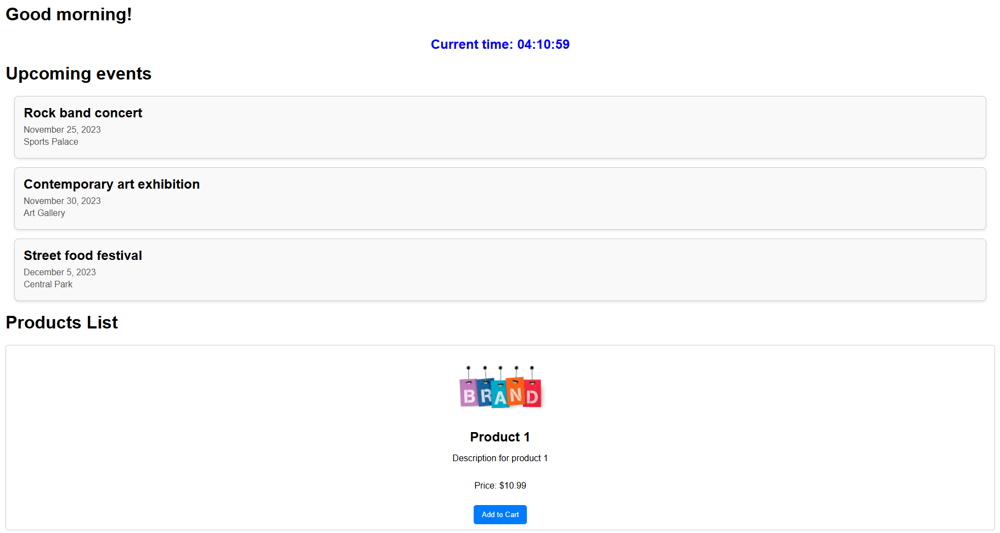

# Seminar 2

For different workshops we will use different pages to test tasks. For this we will set up routing and use the react-router-dom library.

```Terminal
npm install react-router-dom
```

Let's create a new file for a new page. For example, let's create a page "Seminar2".

To do this, create a new folder in the src folder, for example, pages, and inside the file "Seminar2.js".

## Task 1

- Create a Counter component that displays a button and a number.
- The number increases by 1 each time the user clicks the button.

Let's create a Counter.js file and the following code:

```JavaScript
import React, { useState } from 'react';
import './Counter.css';

const Counter = () => {
    const [count, setCount] = useState(0);
    const increment = () => {
        setCount(count + 1);
    };
    return (
        <div className="counter-container">
            <h1 className="counter-title">Counter: {count}</h1>
            <button className="increment-button" onClick={increment}>Increment</button>
        </div>
    );
};

export default Counter;
```

Now we can use the Counter component in your main application component, for example in Seminar2.js:

```JavaScript
import React from 'react';
import Counter from './Counter';

const Seminar2 = () => {
  return (
    <div>
      <h1>Welcome to the counter app!</h1>
      <Counter />
    </div>
  );
};

export default Seminar2;
```

## Task 2

Create a TextInput component that contains a text input field and displays the entered text below it in real time.

Let's create a TextInput.js file with a component:

```JavaScript
import React, { useState } from 'react';
import './TextInput.css';

const TextInput = () => {
    const [text, setText] = useState('');

    const handleChange = (event) => {
        setText(event.target.value);
    };

    return (
        <div className="text-input-container">
            <input
                type="text"
                className="text-input"
                value={text}
                onChange={handleChange}
                placeholder="Enter text here"
            />
            <p className="text-output">You entered: {text}</p>
        </div>
    );
};

export default TextInput;
```

Let's use it in the application:

```JavaScript
import React from 'react';
import TextInput from './TextInput';

const Seminar2 = () => {
return (
<div>
<h1>Welcome to the text input app!</h1>
<TextInput />
</div>
);
};

export default Seminar2;
```

## Task 3

Create a TodoList component that allows adding items to a to-do list via a text input field. The list should be updated when a new to-do is added.

Let's create a TodoList.js file with a component:

```JavaScript
import React, { useState } from 'react';
import './TodoList.css';

const TodoList = () => {
    const [todos, setTodos] = useState([]);
    const [inputValue, setInputValue] = useState('');

    const addTodo = (event) => {
        event.preventDefault();
        if (inputValue.trim()) {
            setTodos([...todos, inputValue]);
            setInputValue('');
        }
    };

    const removeTodo = (index) => {
        setTodos(todos.filter((_, i) => i !== index));
    };

    return (
        <div className="todo-container">
            <h1>Todo List</h1>
            <form className="todo-form" onSubmit={addTodo}>
                <input
                    type="text"
                    value={inputValue}
                    onChange={(e) => setInputValue(e.target.value)}
                    placeholder="Enter a new todo"
                />
                <button type="submit">Add</button>
            </form>
            <ul className="todo-list">
                {todos.map((todo, index) => (
                    <li key={index}>
                        {todo}
                        <button onClick={() => removeTodo(index)}>Remove</button>
                    </li>
                ))}
            </ul>
        </div>
    );
};

export default TodoList;
```

Using TodoList in the main component of the application:

```JavaScript
import React from 'react';
import TodoList from './TodoList';

const Seminar2 = () => {
return (
<div>
<h1>Welcome to the Todo List app!</h1>
<TodoList />
</div>
);
};

export default Seminar2;
```

## Task 4

Create a Timer component that displays a timer that increases by 1 every second. Use useEffect to set and clear the interval.

```JavaScript
import React, { useState, useEffect } from 'react';

const Timer = () => {
const [seconds, setSeconds] = useState(0);

useEffect(() => {
// Set an interval to increment the timer every second
const interval = setInterval(() => {
setSeconds(prevSeconds => prevSeconds + 1);
}, 1000);

// Clear the interval when the component unmounts
return () => clearInterval(interval);
}, []); // An empty array of dependencies so that the effect only fires once on mount

return (
<div>
<h1>Timer: {seconds} seconds</h1>
</div>
);
};

export default Timer;
```

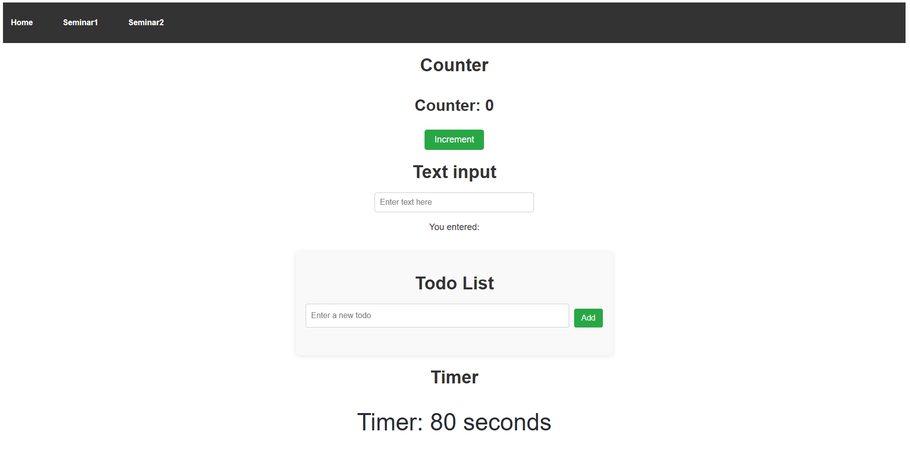

## Homework

### Task: Comments list with deletion.

#### Goal

Combine useState, list rendering, and event handling to create an interactive interface.

#### Task:

Create a CommentsList component that displays a list of comments. Each comment should have a button to delete it. When the button is clicked, the comment should be deleted from the list.

You can use a template:

const [comments, setComments] = useState([
{ id: 1, text: "This is the first comment" },
{ id: 2, text: "This is the second comment" },
{ id: 3, text: "This is the third comment" }
]);

#### Solution

```JavaScript
import React, { useState } from 'react';
import '../css/CommentsList.css';

const CommentsList = () => {
const [comments, setComments] = useState([
{ id: 1, text: "This is the first comment" },
{ id: 2, text: "This is the second comment" },
{ id: 3, text: "This is the third comment" }
]);

const handleDelete = (id) => {
setComments(prevComments => prevComments.filter(comment => comment.id !== id));
};

return (
<div>
<h2>List of comments</h2>
<ul className="comments-list">
{comments.map(comment => (
<li key={comment.id} className="comment-item">
<span>{comment.text}</span>
<button
className="delete-button"
onClick={() => handleDelete(comment.id)}
>
Delete
</button>
</li>
))}
</ul>
</div>
);
};

export default CommentsList;
```

# Seminar 3

## Task 1

- Create a Greeting functional component that takes a name prop and displays the message Hello, {name}!.
- Use the Greeting component in your main App component, passing different names as props.

```JavaScript
import React from 'react';
import '../css/PropsGreeting.css';

const PropsGreeting = ({ name }) => {
    return <h1>Привет, {name}!</h1>;
};

export default PropsGreeting;
```

```JavaScript
import React from 'react';
import PropsGreeting from '../components/PropsGreeting';
const Seminar3 = () => {
    return (
        <div>
            <h1>Props greeting</h1>
            <div>
                <PropsGreeting name="Alexey" />
                <PropsGreeting name="Maria" />
                <PropsGreeting name="Dmitry" />
            </div>
        </div>
    );
};

export default Seminar3;
```


## Task 2

1. Develop a Counter component that displays a number and two buttons: one to increase the value by 1 and one to decrease it by 1.
2. Use the useState hook to manage the state of the counter.
3. The buttons can be made using material ui

Installing Material-UI:

```Terminal
npm install react react-dom
npm install @mui/material @emotion/react @emotion/styled
```

Counter component:

```JavaScript
import { Button, Container, Typography } from '@mui/material';
import React, { useState } from 'react';

const MaterialCounter = () => {
    const [count, setCount] = useState(0);

    const increaseCount = () => {
        setCount(prevCount => prevCount + 1);
    };

    const decreaseCount = () => {
        setCount(prevCount => Math.max(prevCount - 1, 0));
    };

    return (
        <Container style={{ textAlign: 'center', marginTop: '50px' }}>
            <Typography variant="h4" gutterBottom>
                Counter: {count}
            </Typography>
            <Button variant="contained" color="primary" onClick={increaseCount} style={{ marginRight: '10px' }}>
                Increase
            </Button>
            <Button
                variant="contained"
                color="secondary"
                onClick={decreaseCount}
                disabled={count === 0}
            >
                Decrease
            </Button>
        </Container>
    );
};

export default MaterialCounter;
```

Importing the Counter component:

```JavaScript
import { CssBaseline, ThemeProvider, createTheme } from '@mui/material';
import React from 'react';
import MaterialCounter from '../components/MaterialCounter';
import PropsGreeting from '../components/PropsGreeting';

const theme = createTheme();

const Seminar3 = () => {
    return (
        <ThemeProvider theme={theme}>
            <CssBaseline />
            <div style={{ textAlign: 'center' }}>
                <h1>Props Greeting</h1>
                <div>
                    <PropsGreeting name="Alexey" />
                    <PropsGreeting name="Maria" />
                    <PropsGreeting name="Dmitry" />
                </div>
                <h1>Welcome to the Counter App!</h1>
                <MaterialCounter />
            </div>
        </ThemeProvider>
    );
};

export default Seminar3;
```

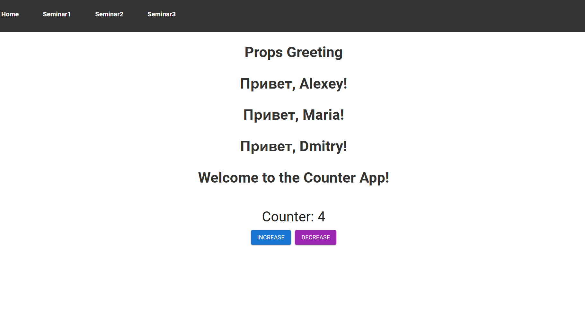

## Task 3

1. Create a MessagesList component that displays a list of messages. Each message must have a unique id and text.
2. Use the key prop when rendering the list to ensure optimal performance.

```JavaScript
import { List, ListItem, ListItemText, Typography } from '@mui/material';
import { styled } from '@mui/system';
import React from 'react';

const StyledListItem = styled(ListItem)({
    borderBottom: '1px solid #ccc',
    padding: '10px 0',
});

const messages = [
    { id: 1, text: 'Hi, how are you?' },
    { id: 2, text: 'Im fine, thanks!' },
    { id: 3, text: 'Whats new?' },
    { id: 4, text: 'Working on a new project.' },
];

const MessagesList = () => {
    return (
        <div>
            <Typography variant="h6" gutterBottom>
                List of messages
            </Typography>
            <List>
                {messages.map((message) => (
                    <StyledListItem key={message.id}>
                        <ListItemText primary={message.text} />
                    </StyledListItem>
                ))}
            </List>
        </div>
    );
};

export default MessagesList;
```

## Task 4

Create a TextDisplayForm React component that allows the user to enter text into an input field and display it on the screen in a styled form when a button is pressed.

- Create an input field (TextField)
  - Add a TextField for the user to enter text.
  - Set the label of the input field to "Enter text".
  - Make the input field full-width.
- Place a button below the input field.
  - Set the button text to "Show text".
  - When the button is pressed, the entered text should be displayed below the button.

```JavaScript
import React, { useState } from 'react';
import { TextField, Button, Typography, Box } from '@mui/material';

const TextDisplayForm = () => {
  const [inputText, setInputText] = useState('');
  const [displayText, setDisplayText] = useState('');

  const handleInputChange = (event) => {
    setInputText(event.target.value);
  };

  const handleButtonClick = () => {
    setDisplayText(inputText);
  };

  return (
    <Box sx={{ maxWidth: 400, margin: 'auto', mt: 5 }}>
      <TextField
        label="Введите текст"
        variant="outlined"
        fullWidth
        value={inputText}
        onChange={handleInputChange}
      />
      <Button
        variant="contained"
        color="primary"
        onClick={handleButtonClick}
        sx={{ mt: 2 }}
      >
        Отобразить текст
      </Button>
      {displayText && (
        <Typography variant="h6" sx={{ mt: 2 }}>
          {displayText}
        </Typography>
      )}
    </Box>
  );
};

export default TextDisplayForm;
```

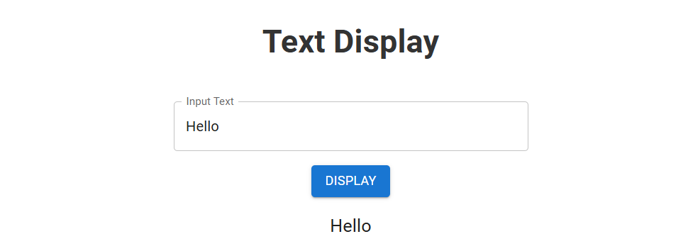

## Task 5

- Create a ThemeSwitcher component. This component will contain a button that will change the interface theme (light/dark) when clicked.
- Use useState to manage the current theme. Store the current theme state in the ThemeSwitcher component.
  The state can be a simple string, such as "light" or "dark".
- Pass the current theme as a prop to another component, which will change its style depending on the received theme. For example, create a Content component that changes its background color depending on the theme.
- Add logic for switching the theme to the ThemeSwitcher.
  When the button is clicked, it should switch between the "light" and "dark" states, and this change should be reflected in the Content component.

```JavaScript
import React from 'react';

const Content = ({ theme }) => {
    const contentStyle = {
        backgroundColor: theme === 'light' ? '#ffffff' : '#333333',
        color: theme === 'light' ? '#000000' : '#ffffff',
        padding: '20px',
        borderRadius: '5px',
        transition: 'background-color 0.3s, color 0.3s',
    };

    return (
        <div style={contentStyle}>
            <h1>Current theme: {theme}</h1>
            <p>This content changes its style depending on the theme.</p>
        </div>
    );
};

export default Content;
```

```JavaScript
import React, { useState } from 'react';

const ThemeSwitcher = ({ onThemeChange }) => {
    const [theme, setTheme] = useState('light');

    const toggleTheme = () => {
        const newTheme = theme === 'light' ? 'dark' : 'light';
        setTheme(newTheme);
        onThemeChange(newTheme);
    };

    return (
        <button onClick={toggleTheme}>
            Switch theme to {theme === 'light' ? 'dark' : 'light'}
        </button>
    );
};

export default ThemeSwitcher;
```

```JavaScript
import { CssBaseline, ThemeProvider, createTheme } from '@mui/material';
import React, { useState } from 'react';
import Content from '../components/Content';
import MaterialCounter from '../components/MaterialCounter';
import MessagesList from '../components/MessagesList';
import PropsGreeting from '../components/PropsGreeting';
import TextDisplayForm from '../components/TextDisplayForm';
import ThemeSwitcher from '../components/ThemeSwitcher';

const Seminar3 = () => {
    const [themeMode, setThemeMode] = useState('light');

    const handleThemeChange = (newTheme) => {
        setThemeMode(newTheme);
    };

    const theme = createTheme({
        palette: {
            mode: themeMode,
        },
    });

    return (
        <ThemeProvider theme={theme}>
            <CssBaseline />
            <div style={{ textAlign: 'center' }}>
                <h1>Props Greeting</h1>
                <PropsGreeting name="Alexey" />
                <PropsGreeting name="Maria" />
                <PropsGreeting name="Dmitry" />
                <h1>Welcome to the Counter App!</h1>
                <MaterialCounter />
                <h1>MessagesList</h1>
                <MessagesList />
                <h1>Text Display</h1>
                <TextDisplayForm />
                <ThemeSwitcher onThemeChange={handleThemeChange} />
                {/* Передаем только режим темы */}
                <Content theme={theme.palette.mode} />
            </div>
        </ThemeProvider>
    );
};

export default Seminar3;
```

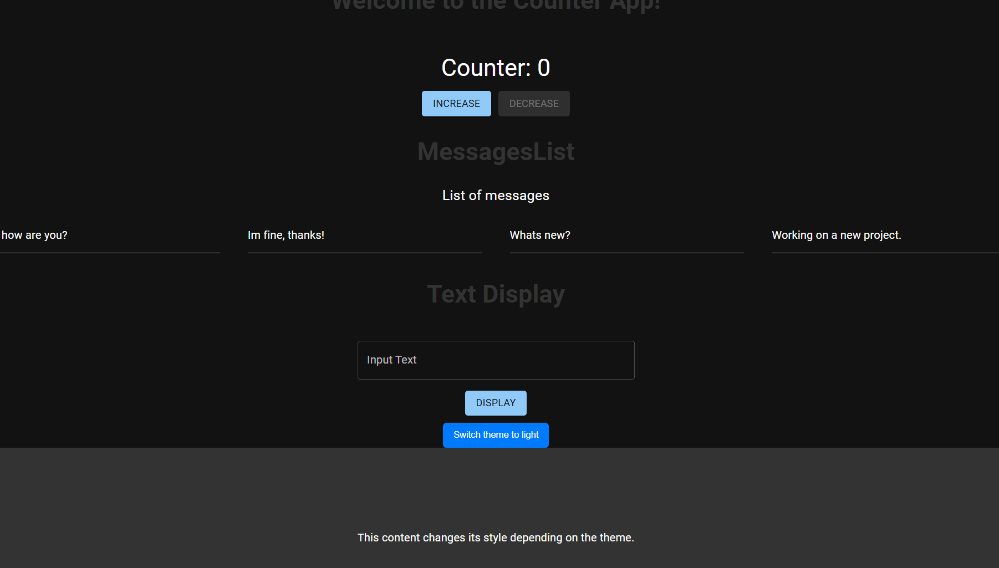

## HomeWork

### Task 1: Temperature Converter with Material UI

Create a TemperatureConverter component using Material UI TextField and Button components to input and display temperatures in Celsius and Fahrenheit.

Components:

- Use a TextField to input a temperature value.
- Add labels to each TextField indicating the units (Celsius and Fahrenheit).

Logic:

- When a value is entered in one field, automatically convert it and display it in the other.
- Implement temperature conversion in both directions.

```JavaScript
import { Box, TextField } from '@mui/material';
import React, { useState } from 'react';

const TemperatureConverter = () => {
    const [celsius, setCelsius] = useState('');
    const [fahrenheit, setFahrenheit] = useState('');

    const handleCelsiusChange = (event) => {
        const value = event.target.value;
        setCelsius(value);
        if (!isNaN(value) && value !== '') {
            const convertedValue = (value * 9 / 5) + 32;
            setFahrenheit(convertedValue.toFixed(2));
        } else {
            setFahrenheit('');
        }
    };

    const handleFahrenheitChange = (event) => {
        const value = event.target.value;
        setFahrenheit(value);
        if (!isNaN(value) && value !== '') {
            const convertedValue = (value - 32) * 5 / 9;
            setCelsius(convertedValue.toFixed(2));
        } else {
            setCelsius('');
        }
    };

    return (
        <Box sx={{ display: 'flex', flexDirection: 'column', alignItems: 'center', mt: 5 }}>
            <TextField
                label="Цельсий (°C)"
                variant="outlined"
                value={celsius}
                onChange={handleCelsiusChange}
                sx={{ mb: 2 }}
                type="number"
            />
            <TextField
                label="Фаренгейт (°F)"
                variant="outlined"
                value={fahrenheit}
                onChange={handleFahrenheitChange}
                type="number"
            />
        </Box>
    );
};

export default TemperatureConverter;
```

### Task 2: Todo List with Material UI

Develop a TodoList component for managing tasks: adding, displaying, and deleting tasks.

Components:

- Use a TextField to enter a new task.
- Add a Button to add a task to the list.
- For each task in the list, use a Card or ListItem from Material UI. Inside each list item, place the task text and an IconButton with a delete icon (e.g. DeleteIcon).

Logic:

- When you click the add button, a new task should be added to the list.
- Next to each task, there should be a button to delete it.

```JavaScript
import DeleteIcon from '@mui/icons-material/Delete';
import { Box, Button, IconButton, List, ListItem, ListItemText, TextField, Typography } from '@mui/material';
import React, { useState } from 'react';

const TodoListMaterialUI = () => {
    const [task, setTask] = useState('');
    const [tasks, setTasks] = useState([]);

    const handleInputChange = (event) => {
        setTask(event.target.value);
    };

    const handleAddTask = () => {
        if (task.trim() === '') return;
        setTasks([...tasks, task]);
        setTask('');
    };

    const handleDeleteTask = (index) => {
        const newTasks = tasks.filter((_, i) => i !== index);
        setTasks(newTasks);
    };

    return (
        <Box sx={{ maxWidth: 400, margin: 'auto', mt: 5 }}>
            <Typography variant="h4" gutterBottom>
                Task List
            </Typography>
            <Box sx={{ display: 'flex', mb: 2 }}>
                <TextField
                    label="New Task"
                    variant="outlined"
                    value={task}
                    onChange={handleInputChange}
                    fullWidth
                />
                <Button variant="contained" onClick={handleAddTask} sx={{ ml: 1 }}>
                    Добавить
                </Button>
            </Box>
            <List>
                {tasks.map((task, index) => (
                    <ListItem key={index} secondaryAction={
                        <IconButton edge="end" aria-label="delete" onClick={() => handleDeleteTask(index)}>
                            <DeleteIcon />
                        </IconButton>
                    }>
                        <ListItemText primary={task} />
                    </ListItem>
                ))}
            </List>
        </Box>
    );
};

export default TodoListMaterialUI;
```


# Seminar 4

## Task 1: Box Component

1. Create a Box component that wraps the content passed in children in a div with some styles (e.g. border and padding).
2. Use Box to wrap different elements (text, images, other components) to demonstrate its reusability.

```JavaScript
import React from 'react';

const Box = ({ children }) => {
    const boxStyle = {
        border: '2px solid #ccc',
        borderRadius: '8px',
        padding: '16px',
        margin: '16px 0',
        backgroundColor: '#f9f9f9',
    };

    return <div style={boxStyle}>{children}</div>;
};

export default Box;
```

```JavaScript
<Box>
                <h2>Heading</h2>
                <p>This is the text inside the Box component.</p>
            </Box>

            <Box>
                
            </Box>

            <Box>
                <button onClick={() => alert('Button clicked!')}>Click me</button>
            </Box>
```

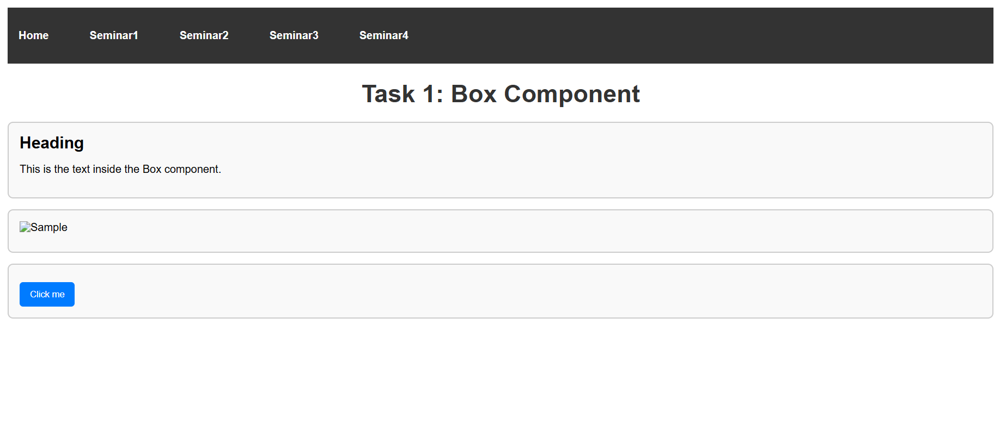

## Task 2: List Component

1. Create a List component that takes a function via props, and that function returns the list items (<li>). List should render those items inside a <ul>.
2. Use List to display a list of items, where each item can have its own unique style or content, defined by the render props function.

```JavaScript
import React from 'react';

const List = ({ renderItems }) => {
    return (
        <ul>
            {renderItems()}
        </ul>
    );
};

export default List;
```

```JavaScript
import React from 'react';
import List from '../components/List';

const App = () => {
const items = [
{ id: 1, content: 'First item', style: { color: 'red' } },
{ id: 2, content: 'Second item', style: { color: 'blue' } },
{ id: 3, content: 'Third point', style: { color: 'green' } },
];

const renderListItems = () => {
return items.map(item => (
<li key={item.id} style={item.style}>
{item.content}
</li>
));
};

return (
<div>
<h1>List of items</h1>
<List renderItems={renderListItems} />
</div>
);
};

export default App;
```

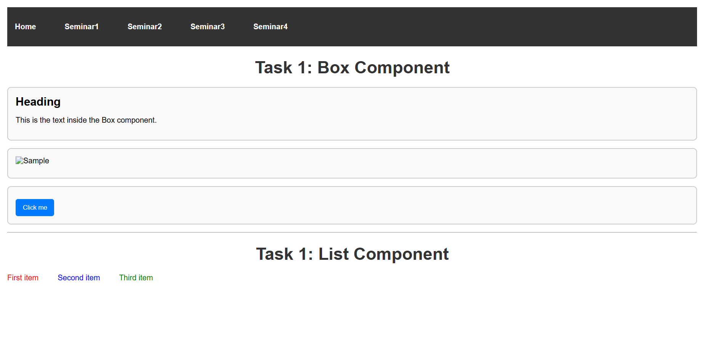

# Seminar 5

## Task 1: Context

Create UserContext and ThemeContext contexts with initial values ​​(e.g. username: "Guest", theme: "light").

- Implement the App component:
  - Wrap the child components in UserContext.Provider and ThemeContext.Provider.
  - Add the ability to change the username and theme through the UI.
- Create components that use these contexts:
  - Header should display a greeting with the username.
  - Profile can show more detailed information about the user or just use the theme for styling.
  - Footer should use the theme for styling and, maybe, display a copyright with the current year.
- Add the ability to change the theme and username in the UI, using the state in the App component and passing the functions to do the changing through the context.

let's create two contexts: UserContext and ThemeContext:

```JavaScript
// UserContext.js
import React, { createContext, useState } from 'react';

export const UserContext = createContext();

export const UserProvider = ({ children }) => {
    const [user, setUser] = useState({ name: 'Guest' });

    return (
        <UserContext.Provider value={{ user, setUser }}>
            {children}
        </UserContext.Provider>
    );
};

// ThemeContext.js
import React, { createContext, useState } from 'react';

export const ThemeContext = createContext();

export const ThemeProvider = ({ children }) => {
    const [theme, setTheme] = useState('light');

    return (
        <ThemeContext.Provider value={{ theme, setTheme }}>
            {children}
        </ThemeContext.Provider>
    );
};
```

Now let's create a component that will use the created contexts.

```JavaScript
import React, { useContext } from 'react';
import Footer from '../components/Footer';
import Header from '../components/Header';
import Profile from '../components/Profile';
import { ThemeContext, ThemeProvider } from '../contexts/ThemeContext';
import { UserContext, UserProvider } from '../contexts/UserContext';
import '../css/style.css';

const Seminar5 = () => {
return (
<UserProvider>
<ThemeProvider>
<Main />
</ThemeProvider>
</UserProvider>
);
};

const Main = () => {
const { user, setUser } = useContext(UserContext);
const { theme, setTheme } = useContext(ThemeContext);

const handleUserChange = (e) => {
setUser({ name: e.target.value });
};

const handleThemeChange = (e) => {
setTheme(e.target.value);
};

return (
<div className={theme}>
<Header />
<Profile />
<Footer />
<div>
<input
type="text"
value={user?.name || ''}
onChange={handleUserChange}
placeholder="Enter username"
/>
<select onChange={handleThemeChange} value={theme}>
<option value="light">Light</option>
<option value="dark">Dark</option>
</select>
</div>
</div>
);
};

export default Seminar5;
```

Now let's create Header, Profile and Footer components that will use contexts.

```JavaScript
// Header

import React, { useContext } from 'react';
import { UserContext } from '../contexts/UserContext';

const Header = () => {
const { user } = useContext(UserContext);

return (
<h1>Hello, {user?.name || 'Guest'}!</h1>
);
};

export default Header;

// Profile

import React, { useContext } from 'react';
import { ThemeContext } from '../contexts/ThemeContext';
import { UserContext } from '../contexts/UserContext';

const Profile = () => {
const { user } = useContext(UserContext);
const { theme } = useContext(ThemeContext);

return (
<div className={`profile ${theme}`}>
<h2>User profile:</h2>
<p>Name: {user?.name || 'Not specified'}</p>
<p>Theme: {theme}</p>
</div>
);
};

export default Profile;

// Footer
import React, { useContext } from 'react';
import { ThemeContext } from '../contexts/ThemeContext';

const Footer = () => {
const { theme } = useContext(ThemeContext);
const currentYear = new Date().getFullYear();

return (
<footer className={theme}>
<p>© {currentYear} My company</p>
</footer>
);
};

export default Footer;
```

## Task 2: HOC withLoadingIndicator

You need to develop a HOC withLoadingIndicator that can be used to wrap any component. This HOC should take a parameter isLoading, which determines whether loading is currently in progress. If isLoading is true, then the loading indicator should be shown instead of the wrapped component.

1. Create a HOC withLoadingIndicator that takes a component and returns a new component that shows either the loading indicator or the contents of the original component, depending on the isLoading prop.
2. You can use a simple text indicator or any spinner from the available libraries.

```Terminal
npm install react-spinners
```

HOC withLoadingIndicator:

```JavaScript
import React from 'react';
import { ClipLoader } from 'react-spinners';

const withLoadingIndicator = (WrappedComponent) => {
  return ({ isLoading, ...props }) => {
    if (isLoading) {
      return (
        <div className="loading-indicator">
          <ClipLoader size={50} color={"#123abc"} loading={isLoading} />
        </div>
      );
    }

    return <WrappedComponent {...props} />;
  };
};

export default withLoadingIndicator;
```

Now let's use HOC:

```JavaScript
import React, { useContext, useEffect, useState } from 'react';
import Footer from '../components/Footer';
import Header from '../components/Header';
import Profile from '../components/Profile';
import { ThemeContext, ThemeProvider } from '../contexts/ThemeContext';
import { UserContext, UserProvider } from '../contexts/UserContext';
import '../css/style.css';
import withLoadingIndicator from '../hocs/withLoadingIndicator';

const Seminar5 = () => {
  const [isLoading, setIsLoading] = useState(true);

  useEffect(() => {
    const loadData = async () => {
      setTimeout(() => {
        setIsLoading(false);
      }, 5000);
    };

    loadData();
  }, []);

  return (
    <UserProvider>
      <ThemeProvider>
        <MainWithLoading isLoading={isLoading} />
      </ThemeProvider>
    </UserProvider>
  );
};

const Main = () => {
  const { user, setUser } = useContext(UserContext);
  const { theme, setTheme } = useContext(ThemeContext);

  const handleUserChange = (e) => {
    setUser({ name: e.target.value });
  };

  const handleThemeChange = (e) => {
    setTheme(e.target.value);
  };

  return (
    <div className={theme}>
      <Header />
      <Profile />
      <Footer />
      <div>
        <input
          type="text"
          value={user?.name || ''}
          onChange={handleUserChange}
          placeholder="Enter username"
        />
        <select onChange={handleThemeChange} value={theme}>
          <option value="light">Light</option>
          <option value="dark">Dark</option>
        </select>
      </div>
    </div>
  );
};


const MainWithLoading = withLoadingIndicator(Main);

export default Seminar5;
```

# Seminar 6

## Task 1: Redux store

Component for adding a task:

- Implement a component with a text field for entering a description
  of the task and an "Add" button that will dispatch an action to add the task to the store.

Component for displaying a list of tasks:

- Create a component that will display a list of all current tasks. For each task, display a description and a "Delete" button that will dispatch an action to remove this task from the store.

```Terminal
npm install react-redux redux
```

let's create a Redux store to manage task state:

```JavaScript
export const ADD_TASK = 'ADD_TASK';
export const REMOVE_TASK = 'REMOVE_TASK';

export const addTask = (description) => ({
  type: ADD_TASK,
  payload: description,
});

export const removeTask = (id) => ({
  type: REMOVE_TASK,
  payload: id,
});
```

```JavaScript
import { ADD_TASK, REMOVE_TASK } from './actions';

const initialState = {
  tasks: [],
};

const taskReducer = (state = initialState, action) => {
  switch (action.type) {
    case ADD_TASK:
      return {
        ...state,
        tasks: [...state.tasks, { id: Date.now(), description: action.payload }],
      };
    case REMOVE_TASK:
      return {
        ...state,
        tasks: state.tasks.filter(task => task.id !== action.payload),
      };
    default:
      return state;
  }
};

export default taskReducer;
```

```JavaScript
import { createStore } from 'redux';
import taskReducer from './reducer';

const store = createStore(taskReducer);

export default store;
```

Now let's create components for adding and displaying tasks:

```JavaScript
import React, { useState } from 'react';
import { useDispatch } from 'react-redux';
import { addTask } from '../redux/actions';


const TaskInput = () => {
const [description, setDescription] = useState('');
const dispatch = useDispatch();

const handleAddTask = () => {
if (description.trim()) {
dispatch(addTask(description));
setDescription('');
}
};

return (
<div>
<input
type="text"
value={description}
onChange={(e) => setDescription(e.target.value)}
placeholder="Enter task description"
/>
<button onClick={handleAddTask}>Add</button>
</div>
);
};

export default TaskInput;
```

```JavaScript
import React from 'react';
import { useDispatch, useSelector } from 'react-redux';
import { removeTask } from '../redux/actions';

const TaskList = () => {
const tasks = useSelector(state => state.tasks);
const dispatch = useDispatch();

return (
<ul>
{tasks.map(task => (
<li key={task.id}>
{task.description}
<button onClick={() => dispatch(removeTask(task.id))}>Delete</button>
</li>
))}
</ul>
);
};

export default TaskList;
```

Now let's create the main component that will use TaskInput and TaskList:

```JavaScript
import React from 'react';
import { Provider } from 'react-redux';
import TaskInput from '../components/TaskInput';
import TaskList from '../components/TaskList';
import store from '../redux/store';

const Seminar6 = () => {
  return (
    <Provider store={store}>
      <div>
        <h1>Task list</h1>
        <TaskInput />
        <TaskList />
      </div>
    </Provider>
  );
};

export default Seminar6;
```

Using redux and react-redux in your app to manage todo state (or any other state) provides several advantages over a regular todo list, which may be stored in local component state. Let's take a look at the main differences and advantages:

1. Centralized state management

- Redux provides a centralized store for your app's state. This means that all data (like a todo list) is in one place, making it easier to manage and access from different components.
- In a regular todo list, the state may be stored in the local state of a single component. This can lead to synchronization issues, especially if multiple components are trying to access or modify the same state.

2. Simplifies data passing

- With redux, you can avoid "passing" props through multiple layers of components. Instead, components can plug into the store and get the data they need directly.
- In a regular todo list, in order to pass data from a parent component to a child component, you may need to pass it through multiple layers of components, making the code more complex and difficult to maintain.

3. Easy to test and debug

- Redux has a clear structure, which makes it more predictable and easier to test. You can easily test reducers and actions separately.
- In a regular todo list, testing can be more difficult, since the state can be scattered across different components.

4. Support for complex applications

- Redux is more suitable for large and complex applications that require managing state that can change depending on different user actions.
- A regular todo list can be sufficient for simple applications, but as the complexity of the application grows, state management can become labor-intensive.

5. Middleware and extensibility

- Redux supports middleware, which allows you to add additional functionality such as logging, handling asynchronous actions (for example, using redux-thunk or redux-saga).
- In a regular todo list, you will have to implement such features yourself, which can lead to code duplication and complexity of logic.

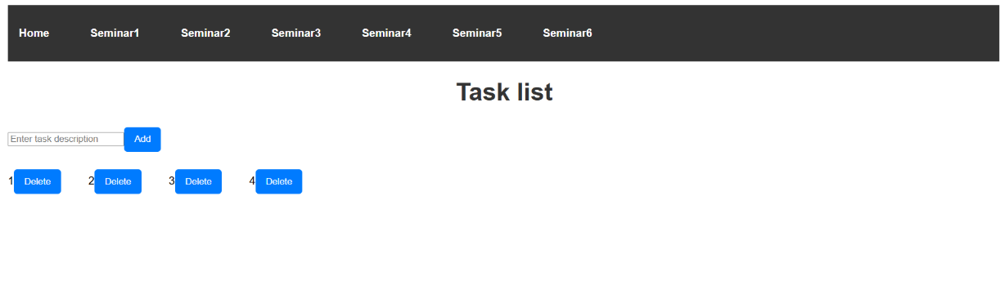

## Task 2: Redux

Create an application that allows users to add products to a favorites list and manage this list (add new products and remove them).

1. Redux Store Setup:
   - Create favoritesSlice using createSlice. Define the initial state, which will contain an array of favorite products. Each product should have an id, name, description, and price.
   - Define reducers for adding a product to favorites and removing a product from favorites.
2. React Components:
   - Create a component that displays a list of all products. For each product, provide an "Add to favorites" button that will add the product to the favorites list.
   - Develop a component that displays a list of products added to favorites. For each product in this list, there should be a "Remove from favorites" button that allows you to remove the product from the list.

```Terminal
npm install @reduxjs/toolkit react-redux
```

[favoritesSlice](/my-first-react-app/src/redux/favoritesSlice.jsx)

```JavaScript
import { createSlice } from '@reduxjs/toolkit';

const favoritesSlice = createSlice({
  name: 'favorites',
  initialState: {
    items: [],
  },
  reducers: {
    addFavorite: (state, action) => {
      state.items.push(action.payload);
    },
    removeFavorite: (state, action) => {
      state.items = state.items.filter(item => item.id !== action.payload.id);
    },
  },
});

export const { addFavorite, removeFavorite } = favoritesSlice.actions;
export default favoritesSlice.reducer;
```

This code creates a slice of state to manage a list of favorites using the Redux Toolkit library. Let's break down what each piece of code does:

```JavaScript
const favoritesSlice = createSlice({
  name: 'favorites',
  initialState: {
    items: [],
  },
  reducers: {
    addFavorite: (state, action) => {
      state.items.push(action.payload);
    },
    removeFavorite: (state, action) => {
      state.items = state.items.filter(item => item.id !== action.payload.id);
    },
  },
});
```

- name: The name of the slice, in this case 'favorites'.
- initialState: The initial state of the slice. Here it contains the items array, which is initially empty.
- reducers: An object containing reducer functions that describe how the state changes when certain actions occur.
  - addFavorite: A function that adds an item to the items array. It takes an action containing the data to add (in action.payload).
  - removeFavorite: A function that removes an item from the items array. It filters the items array, leaving only those items that do not match the id specified in action.payload.

Export actions and reducer:

```JavaScript
export const { addFavorite, removeFavorite } = favoritesSlice.actions;
export default favoritesSlice.reducer;
```

Here we export addFavorite and removeFavorite actions that can be used in components to change state. We also export a reducer that will be used to add to the Redux store.

In your React component, you can use useDispatch from react-redux to dispatch addFavorite and removeFavorite actions to add or remove items from the favorites list.

For example:

```JavaScript
import { useDispatch } from 'react-redux';
import { addFavorite, removeFavorite } from './path/to/favoritesSlice';

const MyComponent = () => {
  const dispatch = useDispatch();

  const handleAddFavorite = (item) => {
    dispatch(addFavorite(item));
  };

  const handleRemoveFavorite = (item) => {
    dispatch(removeFavorite(item));
  };

  // ...
};
```

[reducer](/my-first-react-app/src/redux/reducer.jsx)

Initial state:

```JavaScript
const initialState = {
  tasks: [],
};
```

We define an initial state for the reducer, which contains an array of tasks, initially empty. This state will be used when the reducer is called for the first time.

```JavaScript
const taskReducer = (state = initialState, action) => {
  console.log('Action received in taskReducer:', action);
  switch (action.type) {
    case ADD_TASK:
      return {
        ...state,
        tasks: [...state.tasks, { id: Date.now(), description: action.payload }],
      };
    case REMOVE_TASK:
      return {
        ...state,
        tasks: state.tasks.filter(task => task.id !== action.payload),
      };
    default:
      return state;
  }
};
```

- Reducer function: taskReducer is a function that takes the current state and an action as arguments. If no state is passed, it is initialized to initialState.
- Logging: console.log prints information about the received action, which is useful for debugging.
- Action handling:
  - ADD_TASK: If the action type is ADD_TASK, the reducer returns a new state that:
    - Preserves the previous state using the spread operator (...state).
    - Adds a new task object to the tasks array with a unique id (using Date.now() to generate a timestamp) and a description that is passed in action.payload.
  - REMOVE_TASK: If the action type is REMOVE_TASK, the reducer returns a new state that:
    - Preserves the previous state.
    - Removes the task with an id that matches action.payload from the tasks array using the filter method.
  - default: If the action type does not match any of the specified ones, the reducer simply returns the current state.

[actions](/my-first-react-app/src/redux/actions.jsx)

To manage tasks in a Redux-based application, the following code is used:

```JavaScript
export const ADD_TASK = 'ADD_TASK';
export const REMOVE_TASK = 'REMOVE_TASK';

export const addTask = (description) => ({
  type: ADD_TASK,
  payload: description,
});

export const removeTask = (id) => ({
  type: REMOVE_TASK,
  payload: id,
});
```

The addTask function is an "action creator". It takes a description parameter and returns an action object that contains:

- type: the action type, which is ADD_TASK.
- payload: the payload containing the task description passed to the function.

When you call addTask('Task Description'), you'll get an object that might look like this:

```JavaScript
{
  type: 'ADD_TASK',
  payload: 'Task Description',
}
```

The removeTask function is also an action creator. It takes an id parameter (the ID of the task to be removed) and returns an action object containing:

- type: the type of the action, which is REMOVE_TASK.
- payload: the payload containing the task ID passed to the function.

When you call removeTask(123), you will get an object that might look like this:

```JavaScript
{
  type: 'REMOVE_TASK',
  payload: 123,
}
```

These actions can be used in React components to dispatch actions to the Redux store.

For example, in a component, you can import and use these functions like this:

```JavaScript
import { useDispatch } from 'react-redux';
import { addTask, removeTask } from './path/to/actions';

const MyComponent = () => {
  const dispatch = useDispatch();

  const handleAddTask = () => {
    dispatch(addTask('New Task Description'));
  };

  const handleRemoveTask = (taskId) => {
    dispatch(removeTask(taskId));
  };

  // ...
};
```

[store](/my-first-react-app/src/redux/store.jsx)

Redux store using the @reduxjs/toolkit library makes it easy to set up and use Redux.

- configureStore is a function from @reduxjs/toolkit that simplifies creating a Redux store by automatically adding some useful settings, such as middleware for working with async actions and support for Redux DevTools.
- favoritesReducer and taskReducer are reducers that manage the state of different parts of the application. We described them earlier.

Creating a Redux store:

```JavaScript
const store = configureStore({
  reducer: {
    favorites: favoritesReducer,
    tasks: taskReducer,
  },
});
```

Here we create a Redux store by passing a configuration object to configureStore. In this object:

- reducer: This is an object where the keys are the names of the parts of the state, and the values ​​are the corresponding reducers that will handle changes to that state. In this case:
  - tasks: The state managed by the taskReducer.
  - favorites: The state managed by the favoritesReducer.

This means that the application state will be split into two parts: tasks and favorites, each of which will be handled by its own reducer.

Once the store is created, it can be used in the application by wrapping the root component in a Provider from react-redux to make the store available to all components in the application. For example:

```JavaScript
import { Provider } from 'react-redux';
import store from './path/to/store';

function App() {
  return (
    <Provider store={store}>
      <div className="App">
        <MyComponent />
      </div>
    </Provider>
  );
}
```

Which is what we did in the file [Seminar6](/my-first-react-app/src/pages/Seminar6.jsx):

```JavaScript
import React from 'react';
import { Provider } from 'react-redux';
import FavoritesList from '../components/FavoritesList';
import ProductList from '../components/ProductList';
import TaskInput from '../components/TaskInput';
import TaskList from '../components/TaskList';
import store from '../redux/store';

const Seminar6 = () => {
  return (
    <Provider store={store}>
      <div>
        <h1>Task list</h1>
        <TaskInput />
        <TaskList />
      </div>
      <div>
        <h1>Shop</h1>
        <ProductList />
        <FavoritesList />
      </div>
    </Provider>
  );
};

export default Seminar6;
```

Let's look at the components we imported:

[FavoritesList](/my-first-react-app/src/components/FavoritesList.jsx)

This component displays a list of favorites and allows the user to remove items from the list.

Importing the required modules:

```JavaScript
import React from 'react';
import { useDispatch, useSelector } from 'react-redux';
import { removeFavorite } from '../redux/favoritesSlice';
```

- useDispatch and useSelector: hooks from the react-redux library that allow you to interact with the Redux store.
  - useDispatch is used to dispatch actions to the Redux store.
  - useSelector allows you to fetch data from the Redux store.
- removeFavorite: this is an action creator imported from favoritesSlice, likely used to remove an item from the favorites list.

Extracting data from a Redux store:

```JavaScript
const favorites = useSelector(state => state.favorites.items);
const dispatch = useDispatch();
```

- favorites: using useSelector we get an array of favorites from the Redux state. It is assumed that the favorites state has an items property that contains the list of favorites.
- dispatch: initializes the dispatch function that will be used to dispatch actions to the Redux store.

Item Deletion Handler:

```JavaScript
const handleRemoveFromFavorites = (item) => {
    dispatch(removeFavorite(item));
};
```

This function takes the item to remove and calls dispatch, dispatching a removeFavorite action with the item as a parameter. This action should be handled by the reducer in favoritesSlice to update the state and remove the item from the favorites list.

Returned JSX:

```JavaScript
return (
    <div>
        <h2>Favorites</h2>
        {favorites.length === 0 ? (
            <p>No favorites</p>
        ) : (
            <ul>
                {favorites.map(item => (
                    <li key={item.id}>
                        <h3>{item.name}</h3>
                        <p>{item.description}</p>
                        <p>Price: {item.price} rub.</p>
                        <button onClick={() => handleRemoveFromFavorites(item)}>Remove from favorites</button>
                    </li>
                ))}
            </ul>
        )}
    </div>
);
```

- The component returns JSX that displays the title "Favorites".
- If the favorites list is empty (the length of the favorites array is 0), the message "No favorites" is displayed.
- If the list contains items, they are displayed as a list (<ul>), where each item (<li>) contains:
  - The name of the item (item.name).
  - The description of the item (item.description).
  - The price of the item (item.price).
  - A button that, when clicked, calls handleRemoveFromFavorites to remove this item from the favorites.

[ProductList](/my-first-react-app/src/components/ProductList.jsx)

This component displays a list of products and allows the user to add items to the favorites list.

Add to Favorites Handler:

```JavaScript
const handleAddToFavorites = (product) => {
    dispatch(addFavorite(product));
};
```

This function takes the product to be favorited and calls dispatch, dispatching an addFavorite action with the product as a parameter. This action should be handled by the reducer in favoritesSlice to update the state and add the product to the favorites list.

Otherwise it is identical to the previous example.

## Homework

Develop a product catalog management app that allows adding, deleting, displaying, and editing products.

Redux Store Setup:

Use configureStore from @reduxjs/toolkit to create the store.
Define the initial state and create a slice using createSlice for the products. Each product should have an id, name, description, price, and available.

In the slice, define reducers and actions to add a new product, delete a product by ID, update a product, and change its availability.

React Components:

- Add Product Component:
  Create a form that allows users to enter details of a new product (name, description, price, availability) and add it to the catalog.

- Show Product Component:
  Develop a component that displays a list of all products with their attributes, as well as buttons to remove a product from the catalog and toggle its availability.

- Edit Product Component:
  Optionally, provide the ability to edit existing products so that their name, description, price, and availability can be changed.

### Solution

- Let's create a file [productSlice.jsx](/my-first-react-app/src/redux/productSlice.jsx), in which we will define a slice for managing products. Let's define the main functions for working with products through Store which we will fine-tune.
- Now let's create components for adding, displaying and editing products.
- Component for adding a product [AddProduct.jsx](/my-first-react-app/src/components/AddProduct.jsx)
- Component for displaying products [DisplayProductList.jsx](/my-first-react-app/src/components/DisplayProductList.jsx).
- Component for editing product [EditProduct.jsx](/my-first-react-app/src/components/EditProduct.jsx)

[productSlice](/my-first-react-app/src/redux/productSlice.jsx)
